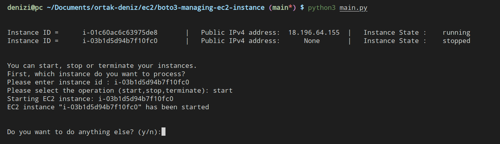

# boto3-managing-ec2-instance

This program list all EC2 instances and allows to start,stop or terminate an instance. 

- Run the program : `python3 main.py` 
- Type instance ID.
- Choose which operation to execute.

